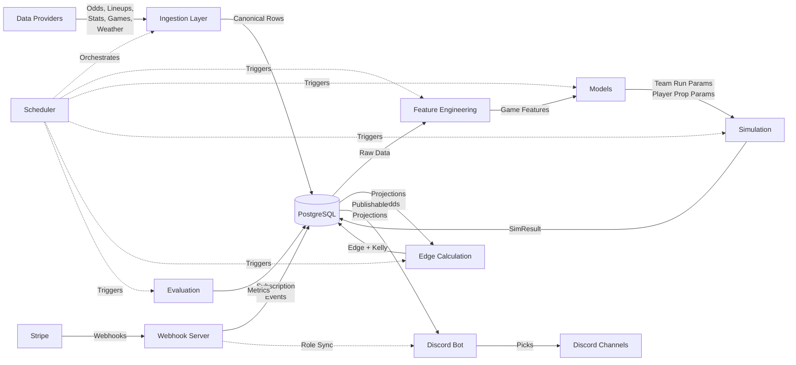
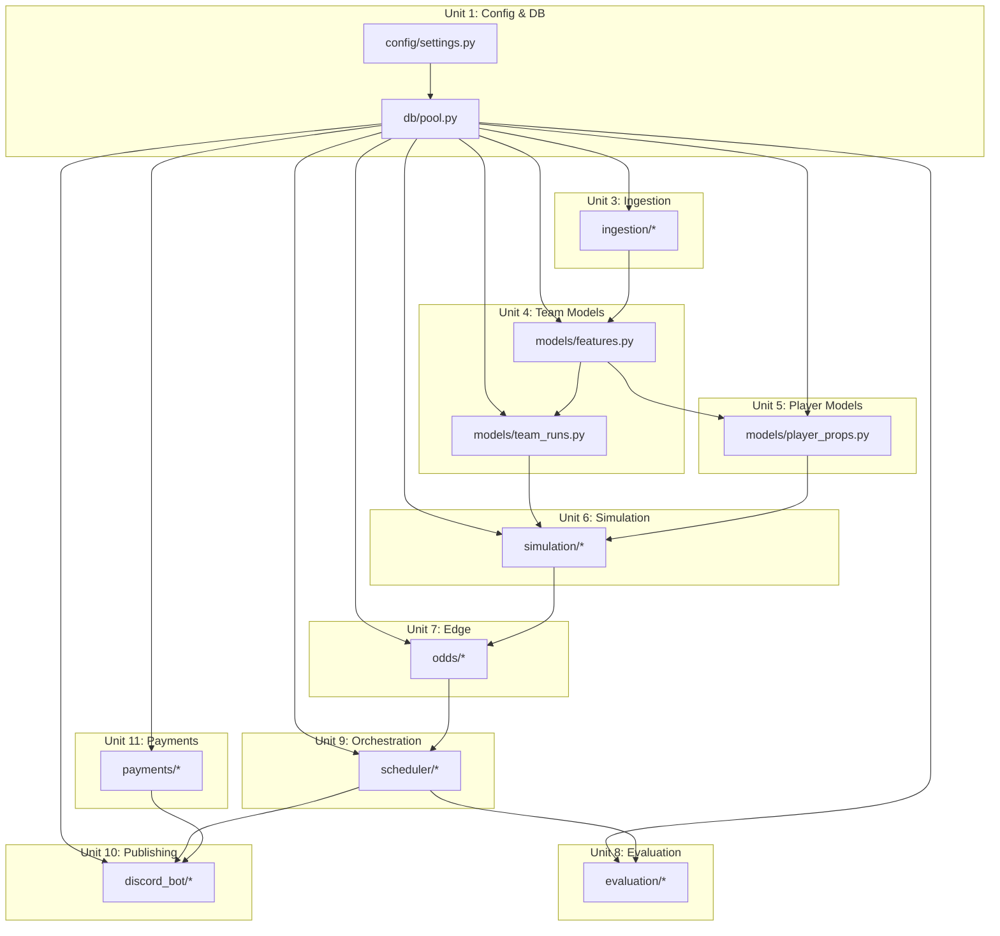

# System Architecture

This document provides a high-level overview of the MLB Analytics Platform architecture, including data flow diagrams and module dependencies.

---

## System Data Flow

The platform follows a linear pipeline architecture with scheduled orchestration and event-driven reruns:



### Pipeline Stages

1. **Data Providers (External):** Odds APIs, lineup sources, stats feeds, game schedules, weather services
2. **Ingestion Layer (Unit 3):** Provider-agnostic adapters that fetch and normalize data into canonical row schemas
3. **Database (Unit 2):** PostgreSQL with 14 tables storing raw data, projections, edges, subscriptions, and evaluation results
4. **Feature Engineering (Unit 4):** Transforms raw data into model-ready features (park factors, weather, pitcher/lineup metrics)
5. **Models (Units 4 & 5):** LightGBM classifiers and regressors for team runs (μ, r) and player props (P(start), PA, outs, event rates)
6. **Simulation (Unit 6):** Monte Carlo engine sampling from Negative Binomial distributions, deriving market probabilities
7. **Edge Calculation (Unit 7):** Best-line selection, proportional devig, edge = p_model − p_fair, fractional Kelly sizing
8. **Discord Bot (Unit 10):** Publishing layer with tier-based channel delivery and anti-spam message management
9. **Webhook Server (Unit 11):** Standalone aiohttp server handling Stripe subscription events and syncing Discord roles
10. **Scheduler (Unit 9):** Orchestrates global runs (night-before, morning, midday), per-game runs (T-90, T-30), and nightly evaluation
11. **Evaluation (Unit 8):** Rolling-origin backtest computing log loss, Brier, ECE, tail accuracy, CLV on completed games

---

## Module Dependency Map



---

## Detailed Data Flow Narrative

### 1. Ingestion Phase (Unit 3)

External data providers deliver odds, lineups, player statistics, game schedules, and weather conditions. The ingestion layer uses provider-agnostic adapters (abstract base classes) to fetch and normalize this data into canonical row schemas. American odds are converted to European decimal format on ingestion. All data is timestamped (`source_ts`, `snapshot_ts`, `fetched_at`) for temporal tracking. Weather is only fetched for outdoor parks; retractable-roof and indoor parks are treated as neutral.

**Output:** Rows written to `odds_snapshots`, `lineups`, `player_game_logs`, `games`, `weather` tables.

### 2. Feature Engineering Phase (Unit 4)

When a projection is triggered (by scheduler or event), the system builds game-level features from the database. This includes:
- Park factors (static seasonal multipliers, applied exactly once to team run mean)
- Weather conditions (temperature, wind, precipitation) with conservative fallbacks for missing data
- Starting pitcher metrics: rest days, rolling pitch count average (30-day window), shrunk ERA using empirical Bayes (k=80 IP prior)
- Lineup strength: OPS calculated from confirmed lineup players with shrinkage (k=200 PA prior)
- Bullpen fatigue: 7-day IP usage
- Team run environment: 30-day rolling R/G

Player-level features are built for hitters (top-7 lineup only) and starting pitchers, including platoon matchup indicators, days rest, rolling event rates, and game context covariates.

**Output:** `GameFeatures`, `HitterFeatures`, `PitcherFeatures` dataclasses passed to models.

### 3. Modeling Phase (Units 4 & 5)

Two sets of models are trained offline on historical final games:

**Team Run Models (Unit 4):**
- Four LightGBM regressors: home μ, away μ, home r, away r
- μ models predict mean runs per team (with park factor applied)
- r models predict dispersion parameter for Negative Binomial distribution
- Models serialized to `models/artifacts/` with timestamp-based versioning

**Player Prop Models (Unit 5):**
- P(start): LightGBM binary classifier predicting probability a hitter starts
- PA distribution: LightGBM multiclass (7 classes: 0, 1, 2, 3, 4, 5, 6+ PA)
- Pitcher outs distribution: LightGBM multiclass (10 classes: 0–3, 4–6, ..., 27+ outs)
- Event rates: Shrunk rolling means (not ML models) for H/PA, HR/PA, K/BF, ER/out, etc.

At prediction time, models load from disk, features are built, and predictions are returned as `TeamRunParams`, `HitterPropParams`, `PitcherPropParams` dataclasses.

**Output:** Prediction parameters passed to simulation engine.

### 4. Simulation Phase (Unit 6)

The Monte Carlo engine samples 2,000–10,000 trials per game:

1. **Team runs:** Sample from Negative Binomial distributions (μ, r) for home and away. Optional correlated noise added via bivariate normal copula (default ρ=0.15).
2. **Tie-break:** If home_runs == away_runs, use simplified probabilistic resolution: P(home_win | tie) = home_μ / (home_μ + away_μ), adjusted by bullpen fatigue differential.
3. **Player stats:** For each hitter, sample PA from pa_dist, then Bernoulli/Binomial for H/HR/BB, Poisson for RBI/R. For pitchers, sample outs from outs_dist, then K and ER from rates.
4. **Market probabilities:** Derive from simulated outcomes:
   - Moneyline: P(home_win), P(away_win)
   - Run line ±1.5: P(home covers), P(away covers)
   - Game total 8.5: P(over), P(under)
   - Team totals 4.5: P(home over), P(away over)
   - Player props: P(stat > main_line) for H, TB, HR, RBI, R, BB, K, outs, ER (hardcoded main lines)

**Output:** `SimResult` with `home_scores`, `away_scores`, `hitter_sims`, `pitcher_sims` written to `projections`, `sim_market_probs`, `player_projections` tables. Edge fields are NULL at this stage.

### 5. Edge Calculation Phase (Unit 7)

For each projection:

1. **Best-line selection:** Query `odds_snapshots` for most recent snapshot per book, select highest price (most favorable) per (market, side, line).
2. **Devig:** Apply proportional devig to both sides of each two-way market from the same book to obtain fair probabilities. If no book provides both sides, skip that market.
3. **Edge:** edge = p_model − p_fair for all team markets and player props.
4. **Kelly sizing:** kelly_fraction = 0.25 × edge / (best_price − 1). If edge < min_edge_threshold (default 0.02), set kelly_fraction = 0.0.
5. **Persistence:** Update `sim_market_probs` and `player_projections` with edge, kelly_fraction, best_price, best_book, edge_computed_at timestamp.

**Output:** All projections have `edge_computed_at IS NOT NULL`, signaling completion to publishing gate.

### 6. Publishing Phase (Unit 10)

The Discord bot polls for publishable projections using the publishing gate:

- **Team markets:** Publishable if `edge_computed_at IS NOT NULL` (no lineup dependency)
- **Player props:** Publishable if `edge_computed_at IS NOT NULL` AND (lineup confirmed OR `p_start >= threshold` (default 0.85))

Only positive-edge plays (edge > 0, kelly_fraction > 0) are published. Picks are routed to tier-specific channels:
- Free channel: One daily free pick (highest-edge team market, 60–90 min window before first pitch)
- Paid channels: All positive-edge plays (5 channels: team-moneyline, team-runline, team-totals, player-props-h, player-props-p)

Anti-spam: One message per (game_id, market, side, line) per channel. Reruns edit existing messages. Message cache is in-memory (cleared on bot restart).

**Output:** Discord embeds sent to channels with all fields (game time, pick, model probability, edge, Kelly sizing, best book).

### 7. Subscription Management Phase (Unit 11)

Users subscribe via Stripe Checkout. Stripe sends webhooks to the standalone aiohttp webhook server:

1. **Checkout completed:** Creates subscription with tier='paid', status='active', links discord_user_id via client_reference_id.
2. **Invoice paid:** Updates status='active', refreshes current_period_end.
3. **Invoice payment failed:** Sets status='past_due', tier remains 'paid'.
4. **Subscription updated:** Syncs status from Stripe (active/trialing → active, canceled/unpaid → cancelled+free, past_due → past_due+paid).
5. **Subscription deleted:** Sets tier='free', status='cancelled'.

Database is source of truth. Discord roles are synced best-effort (grants "Subscriber" role when tier='paid' AND status='active', revokes otherwise).

**Output:** `subscriptions` table updated, Discord roles synced asynchronously.

### 8. Evaluation Phase (Unit 8)

Nightly, after games are final, the evaluation pipeline runs:

1. **Rolling-origin backtest:** For each market (ml, rl, total, team_total), gather all final games from the eval date range. Use most recent projection per game (by run_ts).
2. **Metrics:** Compute log loss, Brier score, ECE (10 bins), tail accuracy (p < 0.15, p > 0.85), median CLV (vs. T-5 closing odds).
3. **Calibration:** If sufficient samples (≥50), fit market-specific calibration model (isotonic regression or Platt scaling). Save to registry.
4. **Persistence:** Upsert 6 rows per (eval_date, market) to `eval_results` table: log_loss, brier, ece, tail_acc_low, tail_acc_high, clv.

**Output:** Evaluation metrics persisted for model monitoring and retrospective analysis.

---

## Orchestration & Scheduling (Unit 9)

The scheduler coordinates all pipeline runs:

**Global Runs (3 per day, configurable times):**
- Night-before run (10 PM ET): Fetch schedule for next day, ingest odds/weather, run all games
- Morning run (8 AM ET): Re-ingest odds/lineups, re-run all games
- Midday run (12 PM ET): Final pre-game update

**Per-Game Runs (2 per game):**
- T-90 minutes: Lineup likely confirmed, run full pipeline
- T-30 minutes: Final odds update, publish if gate passes

**Event-Driven Reruns:**
- Triggered on lineup confirmation, pitcher change, or significant odds movement
- Throttle: At most 1 rerun per game per 10-minute window (configurable)
- In-memory throttle state (not persisted)

**Nightly Evaluation:**
- Runs after midnight for previous day's final games
- Triggers backtest for all major markets (ml, rl, total, team_total)

**Cron Entry Points:**
- `night_before_run()`, `morning_run()`, `midday_run()`, `nightly_eval_run()`
- All are zero-argument async functions wrapped in `asyncio.run()` for cron compatibility

---

## Key Architectural Decisions

- **No ORM (D-005):** Raw SQL migrations and queries keep the stack minimal and predictable.
- **Single pool (D-002):** asyncpg connection pool is a module-level singleton, sufficient for v1 scale.
- **Provider-agnostic ingestion (D-019):** ABCs allow swapping data sources without downstream changes.
- **Park factor applied once (D-010):** Feature engineering applies park factor; simulation uses pre-adjusted μ.
- **Standalone webhook server (D-052):** Decouples payment handling from Discord bot uptime.
- **Best-effort role sync (D-053):** Database is source of truth; Discord role is eventually consistent cache.
- **Publish-only bot (D-047):** No user commands or interactive features in v1; simplifies bot logic.
- **In-memory anti-spam (D-049):** Message cache cleared on restart; acceptable for v1.
- **Hardcoded main lines (D-034):** Simplifies probability derivation; dynamic line detection deferred to v2.

See [DECISIONS.md](DECISIONS.md) for all 54 architectural decisions (D-001 through D-054).

---

## Technology Choices

- **PostgreSQL:** ACID guarantees, mature async driver (asyncpg), no need for NoSQL scalability in v1
- **LightGBM:** Fast gradient boosting, handles tabular data well, lower memory footprint than XGBoost
- **Negative Binomial:** Captures overdispersion in run scoring (variance > mean), critical for tail probabilities
- **Proportional devig:** Simple, deterministic, widely used; no need for power/Shin methods in v1
- **Quarter-Kelly:** Standard fractional Kelly multiplier balancing growth and risk
- **Discord:** Free tier sufficient for v1, tiered channel structure maps naturally to subscription model
- **Stripe:** Industry-standard payments, webhook-based event sync, no PCI compliance burden
- **Cron:** Simple, reliable, universally available; no need for Celery/Airflow in v1

---

## Deployment Architecture

```
┌──────────────────┐       ┌─────────────────┐       ┌──────────────────┐
│  Cron Scheduler  │       │  Discord Bot    │       │ Webhook Server   │
│  (3 global +     │       │  (persistent    │       │ (aiohttp:8080)   │
│   1 nightly)     │       │   process)      │       │                  │
└────────┬─────────┘       └────────┬────────┘       └────────┬─────────┘
         │                          │                         │
         │                          │                         │
         └──────────────┬───────────┴──────────┬──────────────┘
                        │                      │
                   ┌────▼──────────────────────▼────┐
                   │      PostgreSQL Database       │
                   │  (14 tables, asyncpg pool)     │
                   └────────────────────────────────┘
                                 ▲
                                 │
                   ┌─────────────┴────────────┐
                   │  External Data Providers │
                   │  (Odds, Stats, Weather)  │
                   └──────────────────────────┘
```

Three independent processes:
1. **Cron jobs:** Triggered at scheduled times, run pipeline, exit
2. **Discord bot:** Persistent daemon, publishes picks, manages channels
3. **Webhook server:** Persistent HTTP daemon, handles Stripe events

All share a single PostgreSQL database. No inter-process communication beyond the database.

---

## Future Directions (v2+)

- **Alternate lines:** Dynamic line detection from odds, multi-line probability derivation
- **Live betting:** In-game probability updates, state-dependent simulation
- **Reliever props:** Inning-by-inning simulation, bullpen strategy modeling
- **Joint distributions:** Correlated hitter stats (H/TB/HR/RBI/R), proper multivariate sampling
- **ML event rates:** Replace shrunk means with gradient boosting for H/PA, K/BF, etc.
- **Player prop calibration:** Market-specific calibration for hitter/pitcher props
- **Multi-provider failover:** Automatic fallback if primary data source fails
- **Power/Shin devig:** Advanced devig methods for sharper fair probability estimates
- **Interactive bot commands:** `/picks`, `/subscribe`, `/stats`, etc.
- **Admin dashboard:** Web UI for subscription management, model monitoring
- **Mobile app:** Native iOS/Android delivery
- **Multi-sport:** Expand to NBA, NFL, NHL with shared infrastructure

See [README.md](../README.md) section "What This System Does Not Do Yet" for complete v1 exclusions.
